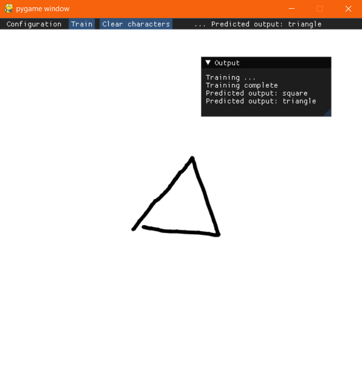

# Character Classifier (school project)

A Python & Dear ImGui application that lets you train a neural network and classify drawn characters and symbols using a custom neural network implementation.

*The appearance of the application's UI*

## Usage

Upon starting the application by running `main.py`, the application will be in dataset creation mode. To add a character to the dataset, draw it onto the canvas and enter its label (class) into the dialog window that appears. Once you're done entering characters, click the `Train` button to train the neural network. You can adjust network and learning parameters in the `Configuration` menu.

After training, the application will enter inference mode. In this mode you can draw characters onto the canvas, and the neural network will classify them.

`Clear characters` resets the dataset.